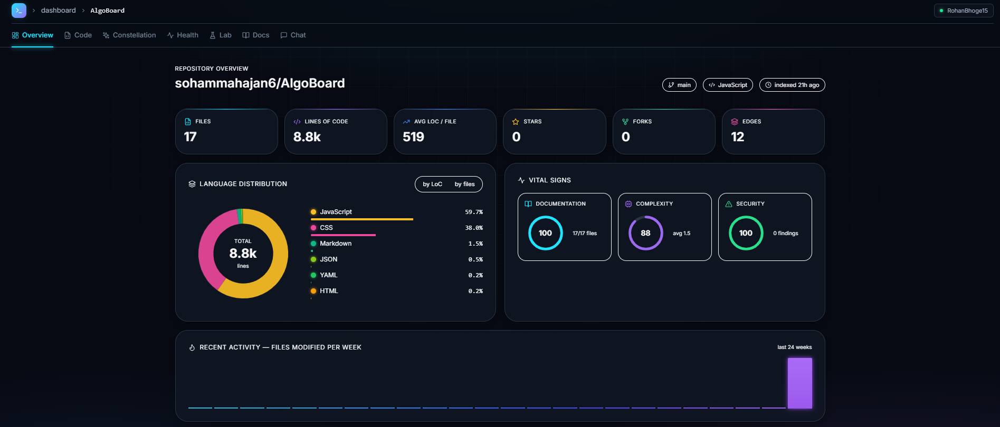
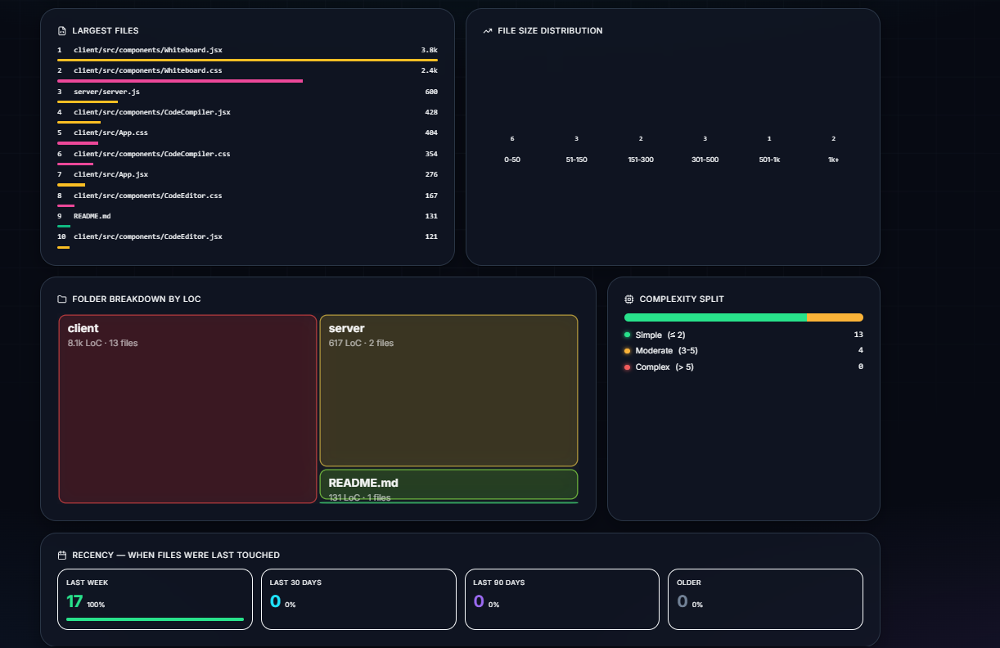
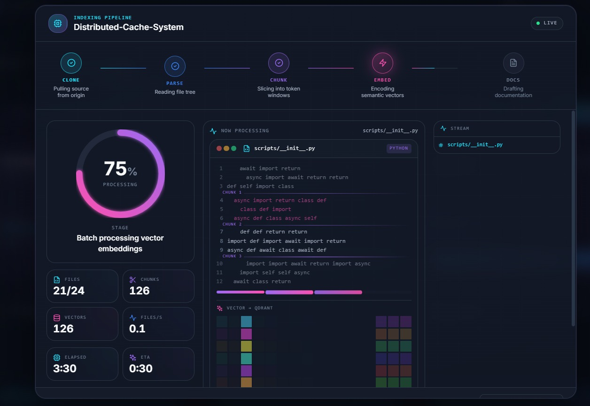
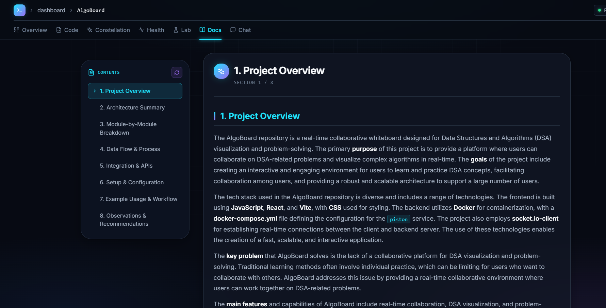
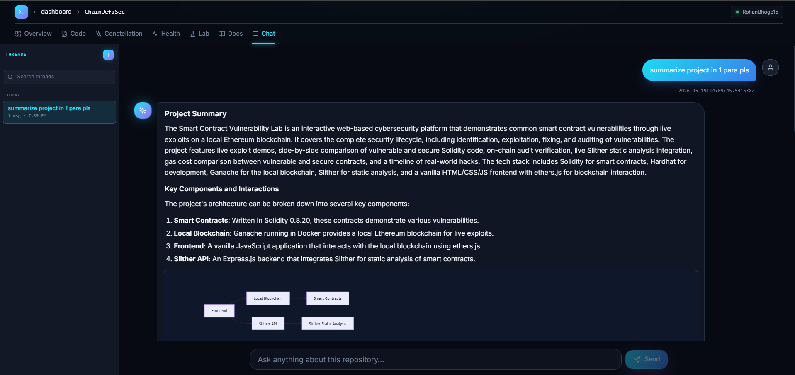
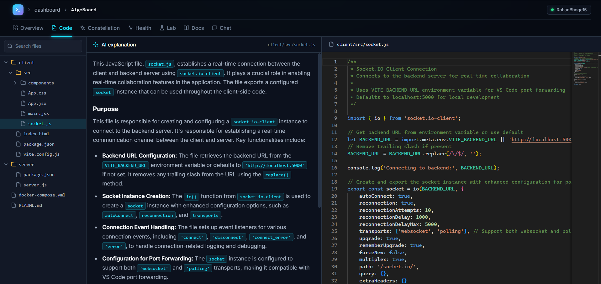
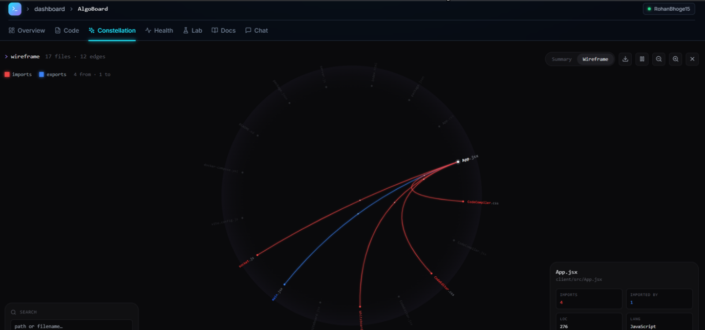

<p align="center">
  
  
  
  
  
  
  
  
</p>

<h1 align="center">RepoMind</h1>

<p align="center">
  <strong>AI-powered codebase intelligence — understand any repo in minutes.</strong><br/>
  Auto-generate docs · Chat with your code · Visualise dependencies as a live wireframe.
</p>

<p align="center">
  <a href="#-dashboard">Dashboard</a> ·
  <a href="#-indexing-process">Indexing</a> ·
  <a href="#-ai-generated-documentation">Docs</a> ·
  <a href="#-chat-with-your-code">Chat</a> ·
  <a href="#-code--ai-explanation">Code</a> ·
  <a href="#-dependency-wireframe">Wireframe</a> ·
  <a href="#-quick-start">Quick Start</a> ·
  <a href="#-architecture">Architecture</a>
</p>

---

## ✨ Why RepoMind?

Onboarding to a new codebase is brutal. You spend days reading hundreds of files, chasing imports, mapping what calls what — and documentation, if it exists at all, is usually stale.

**RepoMind ingests a GitHub repo, builds a semantic understanding of it, and gives you four ways to explore:**

| | What you get |
| :--- | :--- |
| 📚 **Docs** | AI-generated documentation with architecture diagrams across 8 structured sections |
| 💬 **Chat** | Ask questions in natural language — RAG answers cite real files and line numbers |
| 🧭 **Wireframe** | Interactive 2D radial dependency graph — see what imports what at a glance |
| 🩺 **Health** | Vulnerability scan, complexity hotspots, cluster breakdown |

All powered by **NVIDIA NIM** — free, fast, and 40 RPM is more than enough for indexing.

---

## 🤖 AI Stack

| Component | Model / Service |
| :--- | :--- |
| **LLM provider** | **[NVIDIA NIM](https://build.nvidia.com)** (OpenAI-compatible, 40 RPM free tier) |
| **Default model** | **`meta/llama-4-maverick-17b-128e-instruct`** (17B parameters, fast instruct) |
| **Embeddings** | `sentence-transformers/all-MiniLM-L6-v2` (local, CPU-friendly) |
| **Vector store** | Qdrant — cosine-similarity over 384-dim embeddings |
| **Security scanner** | Bandit (Python AST static analysis) |

The model is configurable via `NVIDIA_MODEL` in `.env` — swap to any model NVIDIA NIM exposes.

---

## 🏠 Dashboard

A clean, dark-mode home for every repository you've imported. Browse your GitHub repos, import public repos by URL, and jump straight into any indexed project.

<p align="center">
  
</p>

<p align="center">
  
</p>

---

## ⚙️ Indexing Process

When you index a repo, RepoMind runs a six-stage pipeline asynchronously via a Redis-Queue (RQ) worker — so the UI stays responsive while the heavy lifting happens in the background.

**Stages** (visible in the progress bar):

1. **Cloning** — shallow git clone of the default branch
2. **Analyzing** — language detection, AST parsing, import extraction
3. **Chunking** — split files into ~200-token chunks with 50-token overlap
4. **Embedding** — `all-MiniLM-L6-v2` → 384-dim vectors → Qdrant
5. **Generating Docs** — 8 parallel NIM calls, one per documentation section
6. **Done** — repo ready to explore

Smart caching means only **changed files** are re-processed on subsequent indexes.

<p align="center">
  
</p>

---

## 📚 AI-Generated Documentation

For every indexed repo, RepoMind generates a complete, structured documentation set across **8 sections**. Each section is a separate NIM call (30s timeout per call) so failures stay isolated — if one section hiccups, the others still ship.

The sections:

1. **Project Overview** — what the project is and what problem it solves
2. **Architecture Summary** — high-level system structure + Mermaid diagram
3. **Module-by-Module Breakdown** — every key file/folder explained
4. **Data Flow & Process** — sequence diagrams for the critical paths
5. **Integration & APIs** — external services, endpoints, contracts
6. **Setup & Configuration** — env vars, dependencies, install steps
7. **Example Usage & Workflow** — a realistic walkthrough
8. **Observations & Recommendations** — security, performance, tech debt

<p align="center">
  
</p>

---

## 💬 Chat With Your Code

Ask questions in plain English. RepoMind uses **RAG (Retrieval-Augmented Generation)**:

1. Your question is embedded
2. Qdrant returns the top-K most relevant code chunks (cosine similarity)
3. Those chunks are passed to `meta/llama-4-maverick-17b-128e-instruct` as context
4. The model answers, **citing the exact files and line ranges** it pulled from

So you can ask "how does authentication work?" and get an answer grounded in real code paths — not hallucinated APIs.

<p align="center">
  
</p>

---

## 📄 Code + AI Explanation

Open any file and get an AI-generated explanation right next to the source. Syntax-highlighted code on one side, plain-English narrative on the other — perfect for understanding unfamiliar logic without context-switching to an LLM tab.

<p align="center">
  
</p>

---

## 🧭 Dependency Wireframe

A **2D radial dependency wireframe** — every file sits on the rim, grouped by top-level folder, with monospace labels rotated tangentially. Click any file to spotlight its dependencies:

- 🔴 **Red chords** → files this file imports FROM
- 🔵 **Blue chords** → files that import THIS file
- Faint grey tracery → everything else

Animated tracer dots run along active chords. Labels pulse softly on hover. Background flicker keeps the structure feeling alive without being distracting. Respects `prefers-reduced-motion`.

<p align="center">
  
</p>

---

## 🚀 Quick Start

### Prerequisites

- **Docker** + **Docker Compose** (everything else runs in containers)
- **A GitHub OAuth App** — [create one here](https://github.com/settings/developers) (callback URL: `http://localhost:3000/api/auth/callback/github`)
- **An NVIDIA NIM API key** — [sign in at build.nvidia.com](https://build.nvidia.com), click any model, hit "Get API key" (free tier, 40 RPM)

### 1. Clone & configure

```bash
git clone <this-repo>
cd NewRepomind
cp .env.example .env
```

Edit `.env` and fill in:

```bash
# NVIDIA NIM
NVIDIA_API_KEY=nvapi-xxxxxxxxxxxxxxxxxxxxxxxxxxxxxxxx
NVIDIA_MODEL=meta/llama-4-maverick-17b-128e-instruct

# GitHub OAuth
GITHUB_CLIENT_ID=your_client_id
GITHUB_CLIENT_SECRET=your_client_secret

# Security
SECRET_KEY=your_32_character_minimum_secret
NEXTAUTH_SECRET=your_nextauth_secret_32_chars
```

### 2. Boot everything

```bash
docker compose up -d
```

This brings up 7 services: Postgres, Redis, Qdrant, the FastAPI backend, the Next.js frontend, an RQ worker, and an Nginx reverse proxy.

### 3. Open

- **App** → http://localhost:3000
- **API docs (Swagger)** → http://localhost:8000/docs

Sign in with GitHub, import a repo, and start exploring.

---

## 🏗️ Architecture

<p align="center">
  
</p>

**Storage layout:**

| Store | Purpose |
| :--- | :--- |
| **PostgreSQL** | Users, repositories, files, chunks, chat history, indexing status |
| **Qdrant** | 384-dim embeddings, repo-namespaced collections |
| **Redis** | RQ job queue · response cache · chat session memory |

---

## 📡 API Reference

The backend is a FastAPI app — full interactive docs at `/docs` (Swagger UI) and `/redoc`.

| Route | Purpose |
| :--- | :--- |
| `POST /repos/import` | Import a public repo by URL |
| `POST /repos/{id}/index` | (Re-)index an owned repo |
| `GET /repos/{id}/status` | Live indexing progress |
| `GET /repos/{id}/files` | File tree |
| `GET /repos/{id}/graph` | Dependency graph (nodes + edges) |
| `GET /repos/{id}/docs` | AI-generated documentation |
| `POST /repos/{id}/chat` | RAG chat — grounded in repo code |
| `DELETE /repos/{id}` | Remove repo + cascade cleanup (DB, Qdrant, cache) |

All routes require a JWT (issued via the NextAuth GitHub OAuth flow).

---

## 🐳 Docker Reference

Useful day-to-day commands:

```bash
# Boot the full stack
docker compose up -d

# Rebuild just the frontend after a UI change
docker compose up -d --build frontend

# Tail worker logs (e.g. to watch an indexing job run)
docker compose logs -f worker

# Reset everything (DESTRUCTIVE — drops all data)
docker compose down -v
```

### Container topology

| Container | Image | Role |
| :--- | :--- | :--- |
| `repomind-frontend` | Next.js (built) | UI on `:3000` |
| `repomind-backend` | FastAPI + Uvicorn | REST API on `:8000` (bind-mounted for hot-reload) |
| `repomind-worker` | Python + RQ | Async indexing jobs (bind-mounted for hot-reload) |
| `repomind-postgres` | postgres:16-alpine | Relational store |
| `repomind-redis` | redis:7-alpine | Queue + cache |
| `repomind-qdrant` | qdrant/qdrant | Vector DB |
| `repomind-nginx` | nginx:alpine | Reverse proxy on `:80`/`:443` |

---

## 🗂️ Project Structure

```
NewRepomind/
├── backend/                  FastAPI + RQ worker
│   ├── ai_service.py         NVIDIA NIM client · 8-section doc gen
│   ├── worker.py             Indexing pipeline orchestrator
│   ├── embeddings.py         all-MiniLM-L6-v2 + Qdrant
│   ├── routers/              REST endpoints (repos, chat, docs, files, graph, cache)
│   ├── models.py             SQLAlchemy schema
│   └── requirements.txt
├── frontend/                 Next.js 14 app router
│   └── src/app/repo/[id]/
│       ├── overview/         Repository summary
│       ├── chat/             RAG chat UI
│       ├── docs/             Auto-generated documentation reader
│       ├── constellation/    2D radial dependency wireframe
│       └── lab/              Experimental visualisations (chord, sankey, …)
├── Images/                   Screenshots used in this README
├── nginx/                    Reverse-proxy config
├── docker-compose.yml        7-service stack
├── init-db.sql               Postgres schema bootstrap
└── .env.example              Environment template
```

---

## 🛠️ Configuration

Key environment variables (full list in `.env.example`):

| Variable | Default | Notes |
| :--- | :--- | :--- |
| `NVIDIA_API_KEY` | — | **Required.** Get from build.nvidia.com |
| `NVIDIA_MODEL` | `meta/llama-4-maverick-17b-128e-instruct` | Any NIM-exposed model ID |
| `GITHUB_CLIENT_ID` / `GITHUB_CLIENT_SECRET` | — | **Required.** From your GitHub OAuth App |
| `SECRET_KEY` | — | **Required.** 32+ char random string (`openssl rand -hex 32`) |
| `NEXTAUTH_SECRET` | — | **Required.** Same generation method as above |
| `DATABASE_URL` | (set by docker-compose) | Override only if running outside Docker |
| `REDIS_URL` | (set by docker-compose) | ↑ |
| `QDRANT_URL` | (set by docker-compose) | ↑ |
| `LLM_TEMPERATURE` | `0.7` | Lower → more deterministic |
| `LLM_MAX_TOKENS` | `16000` | Headroom for long docs with diagrams |
| `CHUNK_SIZE` | `200` | Tokens per embedding chunk |
| `CHUNK_OVERLAP` | `50` | Sliding-window overlap |

---

## 🧪 Tech Stack Summary

**Frontend** — Next.js 14 (App Router) · TypeScript · TailwindCSS · NextAuth · framer-motion · React-Three-Fiber (lab views) · Mermaid · react-markdown

**Backend** — FastAPI · SQLAlchemy · Pydantic v2 · PyGithub · Sentence-Transformers · qdrant-client · Redis-py · RQ · Bandit

**AI** — NVIDIA NIM (LLM, OpenAI-compatible API) · `meta/llama-4-maverick-17b-128e-instruct` · `sentence-transformers/all-MiniLM-L6-v2` (embeddings)

**Infra** — Docker Compose · PostgreSQL 16 · Redis 7 · Qdrant · Nginx

---

## 🤝 Contributing

PRs welcome. The codebase is intentionally small and approachable — read through `backend/worker.py` and `frontend/src/app/repo/[id]/constellation/page.tsx` for the two most interesting bits.

---

## 📜 License

MIT.
